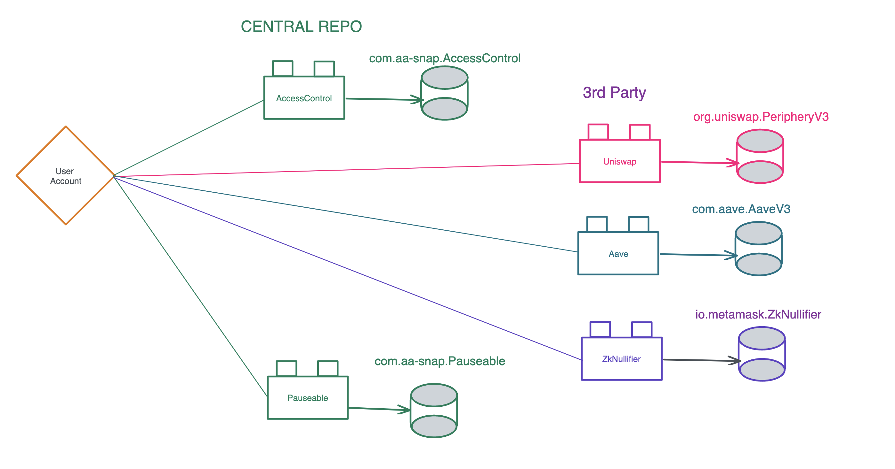

# AA-SNAP (Account Abstraction-SNAP)

## Background
The Ethereum ecosystem has seen the emergence of modular smart contract systems like Diamonds and Multi-Facet Proxy via ERC-2535. These systems enable smart contract developers to create modular and scalable applications by separating concerns and allowing for independent development and deployment of contract modules.

One of the challenges with deploying modular contracts is that developers need to manage different versions of facets and their associated storage slots. In addition, every developer deploys their own versions of these contracts, leading to redundancy and higher costs.

### ERC-4337: Account Abstraction Using Alt Mempool
This Ethereum Improvement Proposal (EIP) proposes a new way of managing account abstraction using an alternative mempool (alt-mempool). The alt-mempool provides a separate transaction pool that can be used to prioritize certain types of transactions, such as those related to account abstraction. By using this approach, it is possible to maintain backwards compatibility with existing Ethereum clients while still providing developers with the ability to create more complex and efficient smart contracts that make use of account abstraction.

### ERC-2535: Diamonds, Multi-Facet Proxy
ERC-2535 proposes a new way of managing smart contracts on the Ethereum blockchain. The proposal suggests creating a new type of contract called a Diamond, which acts as a multi-facet proxy for other smart contracts. The Diamond contract provides a way for developers to add and remove functionality from their contracts without having to redeploy the entire contract. This makes it easier to upgrade contracts and maintain backwards compatibility with existing contracts. The proposal also includes a set of best practices for creating and managing Diamond contracts.

## Introduction
We are thrilled to submit our project proposal, **AA-SNAP**, to the Ethereum Foundation's grant program. Our project is focused on creating a packaging management solution for Account Abstraction upgradeability using the Diamond Standard. With AA-SNAP, developers can publish their Facets (SNAPS) on our platform, and users can easily manage the storage slots of their diamonds.

## Problem
Currently, users face several challenges when trying to **create and manage** their **Account Abstraction upgrades**. For instance, users have to manually upgrade their contracts, which is cumbersome and prone to errors. Moreover, users have to manage the storage slots of their diamonds to avoid collisions, which is a time-consuming and complex process. These challenges make it difficult for users to fully benefit from Account Abstraction.

Developers also face several problems while working with Account Abstraction. For instance, managing facet versions is a challenge, as it requires deploying multiple contracts and managing dependencies. Additionally, there are issues with colliding storage slots, which can result in contracts failing to execute. Every developer deploys their own stuff that costs a lot of money, and they cannot reuse deployed existing libraries.


## Impact
The impact of AA-SNAP will be far-reaching as it will provide developers with an efficient platform to manage and publish their Facets, saving them time and resources. Additionally, users will be able to manage and upgrade their Facets without cumbersome manual upgrades. Our platform checks compatibilities and scans for security before upgrading. Facets that users can use are already security audited. Our project will contribute to the growth and adoption of Account Abstraction in the Ethereum ecosystem.

## Purpose and Goals
The main objective of AA-SNAP is to simplify the process of creating and managing Account Abstraction upgrades using the Diamond Standard. Our platform will provide a seamless and efficient solution for developers to publish their Facets, and users can easily manage the storage slots of their diamonds. By using AA-SNAP, developers can create users upgradeable Account with ease, with an efficient packaging management system.

### Use Cases
AA-SNAP will be a valuable tool for developers working on various Account Abstraction use cases. For instance, 
- Access Control (SNAP that provide access control to user accounts)
- Saving Account (SNAP that can add DEFI strategies to your account)
- Social Recovery (SNAP that can add guardians and recovery processes)
- Adding Account limits, like transaction limit or daily limit
- DeFi connections like Uniswap
- SafeERC20 snap
- ZK-Nullifier (Adding anonymous identifiers via verifiably deterministic signatures on your account)

By using AA-SNAP, users can manage and upgrade their Facets without the need for cumbersome manual upgrades. Moreover, we will perform compatibility checks and security scans before any upgrades to ensure the safety of our users. All published Facets will be security audited, so users can use them with peace of mind.

## Advantages
AA-SNAP provides several advantages over the existing Account Abstraction solutions. Developers do not have to deploy all the contracts functionality (FACET) again and again. With SNAP, users can just add it to their Account. AA-SNAP makes it easy to manage storage slots of diamonds and avoid collisions. Moreover, our platform ensures that Facets are compatible and secure before deployment.

## Architecture
By providing a modularized infrastructure for account abstraction projects, developers can inherit from this base contract and easily integrate the modularized features available in the trusted facet repository or create their own trusted facet repository. This approach not only streamlines the development process but also promotes standardization and collaboration among different projects. The shared infrastructure encourages consistent security practices, improves code reusability, and reduces the likelihood of code duplication. Ultimately, this unified approach fosters innovation and growth within the Ethereum ecosystem, leading to the development of advanced, secure, and user-friendly wallet solutions that cater to diverse use cases and user preferences.


The development of a standardized reference implementation incorporating segregated storage pointers is a crucial step towards ensuring the safe and seamless integration of modular features in the account abstraction wallets. By employing segregated storage pointers, the reference implementation effectively mitigates the risk of storage collisions between different facets, preserving the integrity and reliability of the wallet system. The reference implementation will serve as a resource for the developer community utilizing modularized AA in the future by  promoting best practices in contract development and storage management while minimizing potential vulnerabilities. This, in turn, accelerates the adoption of modular account abstraction wallets and contributes to the overall growth and security of the ecosystem.

## Storage Pattern


The storage pattern used by the Diamond Standard is designed to allow each snap, or "facet," to have its own separate storage while sharing the same contract address.

Each snap within a Diamond contract has its own unique storage slot defined using the keccak256 hashing algorithm. These storage slots are used to store state variables specific to that module.

For example, if we have a module called PeripheryV3 in the org.uniswap organization domain, we might define a storage slot as follows:

```
bytes32 internal constant STORAGE_SLOT =
    keccak256('org.uniswap.storage.PeripheryV3');
```

Likewise, if we have a module called AccessControl in the com.aa-snap organization domain, we might define its storage slot as follows:

```
bytes32 internal constant STORAGE_SLOT =
    keccak256('com.aa-snap.storage.AccessControl');
```

Notice that the storage slot name includes both the organization domain and the name of the SNAP. This naming convention helps to ensure that storage slots are unique across different contracts, even if they have similar variable names.

Using the Diamond Standard, we can easily add new modules to a contract without having to redeploy the entire contract. Each new module can have its own separate storage, allowing for more flexibility and modularity in our smart contract design.

## AA Snap Management / Integration
When a facet is added to the repository, it emits an event that can be indexed and queried using TheGraph, a powerful decentralized data querying protocol.

By leveraging TheGraph, developers can create a decentralized application (dApp) that allows users to easily search, explore, and manage their installed facets. The dApp will provide a user-friendly interface for interacting with the wallet, enabling users to browse the repository of trusted facets, inspect their features, and seamlessly add or remove them as desired. This approach empowers users to customize their wallets according to their unique needs and preferences, while also promoting transparency, security, and trust within the ecosystem. Furthermore, the decentralized nature of the dApp ensures its resilience and independence from centralized control, in line with the core principles of the Ethereum network.

## Implementation Details
AA-SNAP will use the Diamond Standard (EIP-2535) to manage Facets and storage slots of diamonds. Our platform, AA-SNAP Store, will allow developers to publish their Facets. Users will be able to browse available Facets on the store and easily integrate them into their applications. AA-SNAP will be an open-source project with a free and permissive license, and all published Facets will be non-commercial and freely accessible.

### How do we manage compatibilities of snaps:
Standardize snap interfaces: To manage snap compatibility is to standardize the interfaces used by snaps. This involves creating a set of guidelines that each snap developer should follow when building their snap, such as how data should be formatted and how it should be transmitted between snaps. This can help ensure that snaps are compatible with one another, even if they are developed by different teams.
Test and validate snaps: Only tested and validated snaps can be used. We test and validate snaps automatically before they are added to a system. This involves testing each snap individually to ensure that it works as intended and then testing them in combination to verify that they are compatible with one another. This can be a time-consuming process, but it can help avoid compatibility issues down the line.
We will establish a community of snap developers: Developers can help manage compatibility by providing a forum for developers to discuss issues and share solutions. This can help identify and address compatibility issues quickly and efficiently.


## Timeline and Budget
We propose a 6-month timeline for the project, beginning from the date of the grant award. The project will be completed in four phases:

Phase 1 (1 month) - Research and Design
Phase 2 (2 months) - Development of AA-SNAP and AA-SNAP Store
Phase 3 (2 months) - Testing and Deployment
Phase 4 (1 month) - Final documentation and submission

We are requesting a budget of $50,000, which will cover the salaries of the development team, hosting costs, and other expenses related to the development and deployment of AA-SNAP.

## Proposers
- Zeroknots.eth
- [IaM <DEV>](https://github.com/iam-dev)


## Risk, Security Concerns and Remediations
**Corrupt Contract Storage**
Security Concern: Modules may corrupt contract storage via SSTORE or SELFDESTRUCT, affecting the wallet's integrity and reliability.

Remediation: To mitigate this risk, strict security audits will be performed on all modules before they are added to the trusted repository. Additionally, a standardized testing and review process will be established to ensure that new modules do not introduce vulnerabilities.

**Malicious Modules**
Security Concern: Malicious modules may be created to transfer funds from users' wallets without their consent.

Remediation: The project will establish a vetting process for all submitted modules, which includes security audits and reviews by reputable developers and security experts. This process will help prevent malicious modules from entering the trusted repository. Users should only add modules from the trusted repository to their wallets to minimize the risk of malicious module infiltration.
Access Control
Security Concern: Unauthorized access to modules and wallet functions may lead to unauthorized transactions or changes in wallet settings.

Remediation: The project will implement a robust access control mechanism to restrict access to critical wallet functionalities. This mechanism will include multi-signature approval processes, permission management, and the ability to limit access to specific modules.


## Conclusion:
AA-SNAP is an innovative project that will provide a user-friendly and efficient packaging management solution for Account Abstraction upgradeability. Our project aligns with the Ethereum Foundation's grant program's goals and objectives, and we are confident that AA-SNAP will be a valuable addition to the Account Abstraction ecosystem.


## References
- [Account Abstraction Grants 2023](https://esp.ethereum.foundation/account-abstraction-grants)
- [ERC-4337: Account Abstraction Using Alt Mempool](https://eips.ethereum.org/EIPS/eip-4337)
- [ERC-2535: Diamonds, Multi-Facet Proxy](https://eips.ethereum.org/EIPS/eip-2535)
- [SolidState ERC-2535 implementation](https://github.com/solidstate-network/solidstate-solidity)
